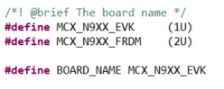

# NXP Application Code Hub

## USB to CAN-FD Adaptor based on MCXN947 Microcontroller
This application note aims to build a USB to CAN-FD adaptor where the USB data retransmit to CAN-bus and vice versa. NXP MCXN devices have a high-speed USB port and CAN-FD controllers. HS USB can reach up to 480 Mbit/s transmission speed, which is enough for transmitting CAN-FD frame at highest CAN baud rate on MCXN 8Mbit/s.

To make the system easy to use and compatible with other devices, we use USB CDC virtual COM port as communication. Python Interface is used to visualize the CAN-FD information in ASCII format.

#### Boards: MCX-N9XX-BRK, MCX-N9XX-EVK
#### Categories: Industrial
#### Peripherals: USB, CAN
#### Toolchains: MCUXpresso IDE

## Table of Contents
1. [Software](#step0_1)
2. [Hardware](#step0_2)
3. [CAN-FD](#step1)
   1. [Differences between CAN and CAN-FD](#step1_1)
4. [USB CDC Class Driver](#step2)
5. [Implementation](#step4)
   1. [Overview](#step3_1)
   2. [Related SDK examples](#step3_2)
   3. [Hardware Implementation](#step3_3)
   4. [Software Implementation](#step3_4)
   5. [Serial commands frames](#step3_5)
   6. [Python GUI Interface](#step3_6)
   7. [Interface description](#step3_7)
6. [Hands On](#step4) 
   1. [Direct communication](#step4_1)
   2. [Monitor CAN network](#step4_2)
7. [Support](#step5)
8. [Release Notes](#step6)

## 1. Software
This code has been implemented using MCUXpresso IDE version 11.8.0 and MCUXpresso SDK - version 2.13.1.
For python GUI Python revision 3.10.10 with the Tkinter module and pySerial library was used. Exe file for Windows created using pyinstaller.

## 2. Hardware
- Purchase supported boards:
   - [FRDM-MCXN947](https://www.nxp.com/part/FRDM-MCXN947#/)
   - [MCX-N9XX-EVK](https://www.nxp.com/part/MCX-N9XX-EVK#/)

## 3. CAN-FD
CAN-FD is defined in the international standard ISO 11898-1:2015. For quick start on using CAN-FD, this section introduces some key features of CAN-FD and aims the users who are familiar with CAN. If you are new with CAN visit [community.nxp.com/CAN](https://community.nxp.com/t5/Blog/101-Controller-Area-Network-CAN-standard/ba-p/1217054). 

## 3.1 Differences between CAN and CAN-FD
There are two key differences between classical CAN and CAN-FD. The first is that CAN-FD can use much higher bitrates than classical CAN. Classical CAN is limited to 1 Mbit/s. CAN-FD does not have a theoretical limit, but in practice it is limited by the transceivers. The second key difference is the increased amount of data per CAN message. Classical CAN is limited to 8 data bytes. CAN-FD limit is increased eight-fold to 64 data bytes per message. With the increased amount of data per CAN message, CAN-FD frames need higher bit rate to decrease the delay time in the communication and increase real-time performance. The CAN-FD frames can reach higher bit rates through enabling bitrate switch feature. On the other hand, the bit rate is higher, the bit time is shorter. In order to enable a data phase bit time that is even shorter than the transmitter delay, the delay compensation is introduced. Without transmitter delay compensation, the bit rate in the data phase of a CAN-FD frame is limited by the transmitter delay.

**Figure 1. CAN-FD vs CAN Frames**

## 4. USB CDC Class Driver
The USB communications device class (or USB CDC) is a composite Universal Serial Bus device class. The class may include more than one interface, such as a custom control interface, data interface, audio, or mass storage-related interfaces. In this case, a USB interface can be used to implement the function of the Virtual COM Port (VCOM), so that communication can be performed through the VCOM on the PC and the embedded system. To learn general information about USB please visit the next link: [USB basic training](https://www.nxp.com/docs/en/supporting-information/Universal-Serial-Bus-Training.pdf)

## 5. Implementation

## 5.1 Overview
USB CDC uses two USB physical buck endpoints to transfer data between PC and MCU. Each endpoint is responsible for uni-directional data transfer.

The example will use two buffers for each pipe, one for USB -> CAN-FD bus and the other for CAN-FD bus -> USB. Once data is on MCU, it will be the responsible to use the information obtained to create the CAN-FD frame and send it and in the opposite way MCU will receive the CAN-FD frame and will extract the data from the frame to send it using the USB CDC to the PC. 

## 5.2 Related SDK examples
Before continuing the task, we need the background knowledge of USB CDC and CAN-FD usage. Both examples are available in MCXN SDK:

- “mcxn9xxevk\_flexcan\_interrupt\_transfer” example:

The flexcan interrupt example shows how to use FlexCAN driver in none-blocking interrupt way.

In this example, 2 boards are connected through CAN bus. Endpoint A(board A) sends a CAN Message to

Endpoint B(board B) when the user presses any key in the terminal. Endpoint B receives the message, prints the message content to the terminal and echoes back the message. Endpoint A will increase the received message and wait for the next transmission of the user to be initiated.

- “mcxn9xxevk\_dev\_cdc\_vcom\_bm” example:

The Virtual COM project is a simple demonstration program based on the SDK. It is enumerated as a COM port, which the users can open using terminal tools, such as TeraTerm. The demo echoes back any character it receives. The purpose of this demo is to show how to build a device of USB CDC class and to provide a simple project for further development.

Both examples can be imported from MCXN SDK available in [Welcome | MCUXpresso SDK Builder (nxp.com)](https://mcuxpresso.nxp.com/en/welcome)

Get familiar with the above two examples before you continue reading. Those two examples are building blocks for USB-CAN adaptor design.

## 5.3 Hardware implementation
The example was created for MCX\_N9XX\_EVK and MCX\_N9XX\_FDRM boards that have the USB phy and the CAN transceiver available to be use without any hardware rework in the boards. The appropriate hardware to use must be selected in board.h file with the next macros:

### MCX-N9XX-EVK board 
**GPIO pins used in USB-CAN adaptor on EVK board**

|**Function**|**GPIO**|**Description**|
| :-: | :-: | :-: |
|CAN0\_TX|P1\_18|CAN bus transmission signal|
|CAN0\_RX|P1\_19|CAN bus reception signal|
|USB1\_DM|USB1\_DM|HS USB DM|
|USB1\_DP|USB1\_DP|HS USB DP|
|UART\_RXD|P1\_8|Debug UART RXD|
|UART\_TXD|P1\_9|Debug UART TXD|

### FRDM-MCXN947 board 
**GPIO pins used in USB-CAN adaptor on FRDM**

|**Function**|**GPIO**|**Description**|
| :-: | :-: | :-: |
|CAN0\_TX|P1\_10|CAN bus transmission signal|
|CAN0\_RX|P1\_11|CAN bus reception signal|
|USB1\_DM|USB1\_DM|HS USB DM|
|USB1\_DP|USB1\_DP|HS USB DP|
|UART\_RXD|P1\_8|Debug UART RXD|
|UART\_TXD|P1\_9|Debug UART TXD|

## 5.4 Software implementation
The software was created based on two bare metal SDK examples: USB Device CDC VCOM and FlexCAN Interrupt. Once both of them were integrated a simple serial protocol is adapted in the application on top of them to be able to convert CAN message into ASCII serial messages that will be sent over the USB Device CDC in this case to the python interface and vice versa.

The next steps are an overview about how the USB to CAN project example was created:

1. Use mcxn9xxevk\_dev\_cdc\_vcom\_bm as baseline.
2. Integrate mcxn9xxevk\_flexcan\_interrupt\_transfer demo
   - Copy CAN TxD and RxD pins configuration into pin\_mux.c file
   - Integrate fls\_flexcan driver to the project in drivers folder
   - Integrate the functions in flexcan\_interrupt\_transfer.c 
3. Create the adaptation layer were the CAN message will be converted into serial message and vice versa
4. In USB callbacks (USB\_DeviceCdcVcomCallback)  identify where to process the received message to convert into CAN message and sent it.
5. In CAN callback identify the reception complete to know when to convert CAN frame into serial message and send it using USB CDC.  

The full MCXN software example is available in this repository.

Next diagram shows the high level block diagram design for this example. 

The main functions for the application are located in the next files:

*can\_interface.c*

File with all CAN related functions. CAN send, CAN receive and FlexCAN Initialization functions

*usb\_cdc\_vcom.c*

File with all USB related functions. USB CDC send, USB CDC receive and USB initialization function.

*usb\_to\_can.c*

File to support the serial protocol with reception inputs functions to parse the messages. 

*usb\_can\_adapter.c*

File with the main function to call the initializations. 

## 5.5 Serial commands frames
USB-CAN adaptor registers as a virtual serial port on the host computer, to have a easy human interaction with the interface the CAN commands will be received in the python interface as ASCII characters and in the same way the interface will send ASCII commands that will be convert into CAN commands previously to be send.

For this purpose the frames should be created in the next specific format:

|**FD ID**|**Frame Start**|**CAN ID**|**DLC**|**Data**|
| :-: | :-: | :-: | :-: | :-: |
|2 Char|1 Char|3 Char|1 Char|2 to 128 Chars Depending on DLC|

   - FD ID : Characters “FD” to identify if the frame is CAN-FD or not. 
   - Frame Start :  ACII character ‘s’ or ‘S’ use to identify the start of CAN frame.
   - CAN ID: 3 Characters with valid values from “0 to 9” or “A to  F” that corresponds to the hexadecimal value of the real CAN ID. 
   - DCL: 	Valid DLC options:

|**DLC Value**|**Byte length**|**Number of characters**|
| :-: | :-: | :-: |
|1|1|2|
|2|2|4|
|3|3|6|
|4|4|8|
|5|5|10|
|6|6|12|
|7|7|14|
|8|8|16|
|10|16|32|
|13|32|64|
|15|64|128|

   - Data: 2 to 128 characters with valid values from “0 to 9” or “A to  F” that corresponds to the hexadecimal value in the CAN Frame. 

Example :

`	`FDs12381122334455667788

|**FD ID**|**Frame Start**|**CAN ID**|**DLC**|**Data**|
| :-: | :-: | :-: | :-: | :-: |
|FD|s|123|8|1122334455667788|

## 5.6 Python GUI Interface
Python is one of programing languages with more relevance in the recent years. The community have develop really useful libraries and tools that allow us to automate process or like in this case to develop interfaces.

The Python interface in this example was created using Python revision 3.10.10 with the Tkinter module and pySerial library, all of these tools are widely documented on the web and there are many good examples to take as baseline.

The code for this example is included in the project in the python\_gui folder. Or you can only use the MCXUSBtoCAN_GUI.exe windows executable if you are not interested on this topic, located on python\_gui\dist.  

## 5.7 Interface description
Interface supports the next: 

- Port Selection: Will allow you to select the COM for your USB CDC board.
- CAN Baudrate: Will select the arbitration phase baud rate.
- CAN-FD Baudrate: Will select the data phase baud rate.
- Connect: Must be clicked once the port and baudrates are selected. This will start the serial communication with our device.
- In the window in the middle we will be able to see the received and transmitted CAN messages
- FD: This check box is to select between CAN or CAN-FD transmissions but this check box does not control the microcontroller configuration only the serial message to be transmitted through serial. 
- CAN ID: Select the CAN ID to send a message
- DLC: Indicate the DLC for the length data. In case that data length is not allowed it will show an error.
- Data: Message to be transmitted. The length must be even numbers from 2 to 16, 32, 64 or 128 characters accordingly the DLC description. 

## 6. Hands On
In the next examples the USB to CAN adaptor will be use to communicate with a CAN device or to monitor a communication in a CAN networking.

## 6.1 Direct communication
This example requires 2 boards. One board will run the USB to CAN Adaptor code and the other will run mcxn9xxevk\_flexcan\_interrupt\_transfer demo.

Prepare the example:

- Connect USB cable between J5 debug USB port to PC Host in both boards.
- Connect a USB cable between the PC host and the J27 USB device port on the board that will run USB to CAN code.
- Board to board CAN connections need to be as follows:

 

|**Node A USBtoCAN**|**Node B CAN interrupt demo**|||
| :-: | :-: | :- | :- |
|Signal Name|Board Location|Signal Name|Board Location|
|CANH|J29-1|CANH|J29-1|
|CANL|J29-2|CANL|J29-2|
|GND|J29-4|GND|J29-4|

- Download the example code to the boards. One board needs to be programmed with the USB to CAN adaptor source code that comes alongside this application note, and the other board needs to be programmed with the flexcan\_interrupt\_transfer demo imported directly from the MCXN9 SDK.
- From the board with the mcxn9xxevk\_flexcan\_interrupt\_transfer demo open a serial terminal on PC with these settings:
- 115200 baud rate
- 8 data bits
- No parity
- One stop bit
- No flow control
- Either press the reset button on your board or launch the debugger in your IDE to begin running the demos.

Run the example:

1. Open Python interface either with MCXUSBtoCAN\_GUI.py or MCXUSBtoCAN_GUI.exe
2. Select the COM that corresponds to USB CDC.
3. In this example CAN Baud rate will be 1000000 and CAN-FD Baud rate 2000000.
4. Click on Connect button.
5. Set the FD checkbox. 
6. On the mcxn9xxevk\_flexcan\_interrupt\_transfer demo select node A as option.
7. Press any key on the serial terminal to send a CAN message.
8. Write the value 01 in Data section and click Send button. 
9. Now you can repeat steps 7 and 8. Just remember that mcxn9xxevk\_flexcan\_interrupt\_transfer demo after sending a CAN message is in a loop waiting to receive a message and after receiving the message will wait until a CAN message is send using the terminal. 

**Serial Terminal after running the demo**

**Python GUI interface after running the demo**

## 6.2 Monitor CAN network
In this example we are going to need a CAN network with 2 or more devices. The MCXN board with the USB to CAN adaptor code will be connected to the network. The goal is to monitor all the traffic on the network. This demonstration will use two NXP boards running the can\_interrupt\_transfer demo in both boards as the CAN network.

Prepare the example:

- Connect USB cable between J5 debug USB port to PC Host in board.
- Connect a USB cable between the PC host and the J27 USB device port on the board.
- CAN connection to the network as follows:

|**Node A USBtoCAN**||
| :-: | :- |
|Signal Name|Board Location|
|CANH|J29-1|
|CANL|J29-2|
|GND|J29-4|

- Download the example code to the board. 
- Either press the reset button on your board or launch the debugger in your IDE to begin running the demos.

Run the example:

1. Open Python interface either with MCXUSBtoCAN\_GUI.py or MCXUSBtoCAN_GUI.exe
2. Select the COM that corresponds to USB CDC.
3. In this example CAN Baud rate will be 1000000 and CAN-FD Baud rate 2000000.
4. Click on Connect button.
5. Set the FD checkbox. 
6. Start the data transmission on the CAN network and just check what the USB to CAN interface catch.

**Python GUI interface after running the demo**

## 7. Support
If you have any questions or feedback on this code please contact NXP support or post on our community at https://community.nxp.com/. You can find forums here for different aspects of this code example, including MCUXpresso tools and device families.

#### Project Metadata
<!----- Boards ----->
 

<!----- Categories ----->

<!----- Peripherals ----->
 

<!----- Toolchains ----->

Questions regarding the content/correctness of this example can be entered as Issues within this GitHub repository.

>**Warning**: For more general technical questions regarding NXP Microcontrollers and the difference in expected funcionality, enter your questions on the [NXP Community Forum](https://community.nxp.com/)

## 8. Release Notes
| Version | Description / Update                           | Date                        |
|:-------:|------------------------------------------------|----------------------------:|
| 1.0     | Initial release on Application Code Hub        | January 3rd 2024 |

